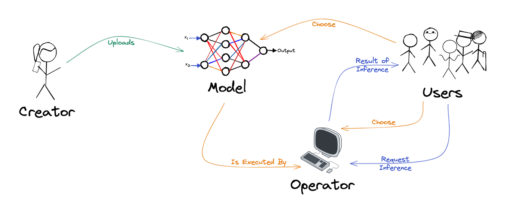
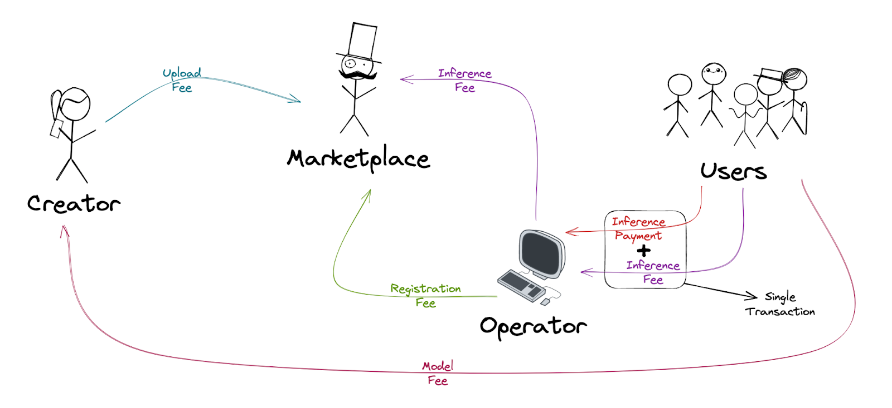

# Fair Protocol
#### **A Decentralized Inference Marketplace for Artificial Intelligence**
#### **Authors: Tiago Ferreira, Luís Silvestre**
#### **28 March 2023 (Version 0.01)**

## Abstract

Big tech companies' centralization of Artificial Intelligence (AI) computation and models has raised concerns about the concentration of power and control over AI technology. This centralization creates challenges such as limited access to AI technology for smaller organizations and potential biases in AI models that reflect the values and interests of the dominant tech companies.

This paper proposes Fair Protocol, a marketplace that pretends to address the abovementioned problems by leveraging the Arweave blockchain and its main layer 2, Bundlr, to decentralize AI inference computation. It presents a promising solution to the problem of centralization of AI computation, offering a decentralized approach that can promote more significant equity, access, and transparency in the development and deployment of AI technology. The technical details of this proposed solution are explored, as well as some risks and warnings about using it.

## I. Introduction

The rapid development of Artificial Intelligence (AI) has brought about a paradigm shift in how we interact with technology. From virtual assistants to self-driving cars, AI-powered systems are becoming increasingly pervasive in our daily lives. However, the benefits of AI are not evenly distributed, and the concentration of computing power and data in the hands of a few large companies has raised concerns about the centralisation of AI capabilities.

In particular, the problem of centralisation arises when companies that possess large amounts of computing resources and data also control the development and deployment of AI algorithms. This circumstance creates a power imbalance that can limit competition, innovation, and access to AI tools for smaller companies and individuals. Additionally, it can lead to privacy violations, biased algorithms, and other negative societal impacts.

One of the most significant manifestations of this problem is the AI inferences in models that are not open-source, like the newly launched GPT-4. Inference is defined as using a trained AI model to make predictions or decisions based on new data. In contrast, GPT-4 is a state-of-the-art language model developed by OpenAI and designed to be a versatile and powerful tool for natural language processing, capable of generating human-like text in response to various prompts and questions. 

Since these closed models can achieve impressive results on question answering and natural language inference at the cost of high centralised computation, and since such centralised computation results in the problems mentioned above, there is a growing demand for more decentralised and democratised AI solutions that allow for broader access and more equitable distribution of AI technology.

To respond to the above demand, we present in this paper Fair Protocol, the Marketplace that aims to decentralise an AI model inference using Arweave and Bundlr. Arweave is a blockchain-based decentralised platform that seeks to provide permanent and low-cost data storage solutions. Bundlr, on the other hand, is a layer 2 solution built on top of the Arweave blockchain that aims to provide a faster, more efficient, and cost-effective way to store and share content on the Arweave network.

The rest of the whitepaper is structured as follows. In Section II, we introduce the protocol's different participants and the relationship between them. In Section III, there is a brief explanation of the types of AI supported by the Marketplace. Sections IV and V present a detailed description of the flow and the economics of the application, respectively. A brief explanation of the types of updates supported in the Marketplace for its participants can be seen in Section VI. Sections VII and VIII discuss the balance of power between participants and the application statistics, respectively. Details on cancellations of transactions can be seen in Section IX. Penalties for application participants can be seen in Section X, while the dangers of using the application and the cautions to have when using it can be seen in Section XI. Sections XII and XIII show possible future developments and a conclusion to this paper, respectively.

## II. Participants

Marketplace participants can be divided into 4 groups: Application Users, Model Operators, Model Creators and Marketplace Owners. To make it easier to understand this document, we have divided these groups by mentioning them by Users, Operators, Creators, and Marketplace Owners, respectively. Below is an explanation of what each one of these groups represents.

### Application Users

Users are all the participants who want to obtain model inferences in a decentralized way without installing or running the same models on their devices, obtaining the advantages mentioned above. To do this, they will select a specific model to perform the AI task they want and an Operator to run it.

### Model Operators

Operators are all the participants who will run model inferences required by Users, following the rules for installing and running models defined by Creators. Since running these inferences incurs computational and resource costs, each Operator charges Users a payment for its services.

Operators are responsible for performing all the inferences a User requests and validating that the code sent to the Marketplace by Creators does what it is supposed to.

### Model Creators

Creators are all the participants who put models on the Marketplace. To do so, they need to upload the model to Arweave. Operators will then execute inferences on these models based on input from Users. Creators will also define some fees that will be paid by Operators and Users when using the model, as explained in Section V.

Creators are responsible for providing Operators with all the necessary instructions at the time of upload to run these models in the most comprehensive way possible, including as many operating systems as possible. They must also provide the necessary scripts for the constant confirmation of new inference requests by Users to Operators and include in these same scripts the validations and protections against possible attacks by Users against the Operators or the correct execution of the code.

Because describing the instructions for installing models is laborious and time-consuming, and because coding the scripts and eventually building such models also has inherent computational costs, Model Creators at the time of the Upload must request a fee that will be paid by Users when they first want to use the model.

The main goal of the Marketplace is for Creators to upload their models trained by themselves. However, anyone can upload any file to the Marketplace as long as they pay the fee required by the Marketplace. That fee aims to create a financial disincentive for potential bad actors who want to fill the application with unnecessary or dysfunctional models when uploading to Arweave.

### Marketplace Owners

Besides producing all the code of the application, the Marketplace Owners are responsible for balancing the scales between Creators, Operators and Users, trying to keep bad actors among all of them to a minimum by creating appropriate rules for all.

As these tasks take time and the Marketplace team intends to continue developing new features and applications, the Marketplace also charges a fee for its services to Users. More details about this fee can be seen in Section V, while more information about ideas for new features and applications can be seen in Section XII.

## III. Supported AI Features

For this version of the Marketplace, we have divided the models' inference into three categories:

* Models that perform inference on text prompts;
* Models that perform inference on files (audios, videos, images, text files, or others);
* Models that perform inference on both text prompts or files.

When the Creator is performing the upload process of a model, he must choose which of the three scenarios best suits his model. This decision is critical in terms of User Experience (UX) because it will limit Users from sending text prompts or sending files to Operators if the model does not support any of these formats.

All supported scenarios are presented in a chat format. On the right are the files or prompts inserted by Users for Operators to perform the respective inferences, and on the left are the corresponding responses returned by Operators.

A User may have several chats separators with the same model, and their organisation is up to the User. For example, in a model that makes inferences about images, a User can create a separator for each different image or can use the same chat for all of them.

Models that have dependencies on previous inferences are also supported. To accomplish this, the Creator should conform the script so that Operators can handle all the files or prompts already sent in that chat, not just the last message or prompt.

## IV. Full Flow

The whole flow of the application regarding inference can be seen in Image 1:

|| 
|:--:| 
|***Image 1:*** *Full inference flow of the Fair Protocol.*|

The process begins with a Creator submitting a model to the application and uploading it to Arweave, along with Markdown rules and scripts to install and use the same model. That model will be available in the application once the blockchain confirms the payment. Operators can then start running the model on their computers, following the rules imposed by the Creators, and sign up to begin operating it on the Marketplace.

Afterwards, Users can choose any model they wish to use and which Operator they want to use to perform inference. Text prompts or documents needed to perform inference are sent to Arweave by the Users. The Operator, in turn, will have a program running full time, waiting for any inference request written for him on Arweave, and if it has one, it will perform the inference and write the answer on Arweave. The answer will then be available for the User to read in the Marketplace.

## V. Marketplace Economy

The whole flow regarding the economics of the application can be seen in Image 2:

|| 
|:--:| 
|***Image 2:*** *Full economic flow of the Fair Protocol.*|

The Marketplace has a set of fees and payments between participants in the Marketplace. These charges aim to create the right incentives for good actors to participate in the network and do their jobs, while bad actors face penalties and are disincentivised to operate.

A more detailed description of each of the fees, as well as their corresponding explanation, can be seen below:

* **Upload Fee:** When a Creator uploads a model, they pay a fee to the Marketplace. The purpose of this fee is to discourage submissions of dysfunctional or irrelevant models to the Marketplace. The cost is fixed and amounts to 0.1 AR;
* **Model Fee:** Before requesting the first Inference of a model, a user must pay a fee to the Creator, who determines its amount when uploading the model. A more detailed explanation of how this fee is calculated, as well as its purpose, can be found further down in this section;
* **Registration Fee:** For an Operator to register on the Marketplace, it must pay a fee for each model it starts working with. The Creator sets the amount of this fee when uploading the model. A more detailed explanation of how this fee is calculated, as well as its purpose, can be found further down in this section;
* **Inference Payment:** Because running inferences costs operators computing power and requires time and person-hours to set up, an Operator charges the User to do it. The Operator is responsible for responding to all the requests the Users execute, on the risk of being delisted from the Marketplace if they don't do so. If the User does not pay the necessary amount for the "Inference Payment", no penalty will occur to the Operator;
* **Inference Fee:** A User disburses an Inference Fee of 5% of the amount charged by the Operator to the Marketplace. For the User's convenience, this fee is paid in a single transaction along with the "Inference Payment" to the Operator, and the Operator then pays the same 5% to the Marketplace. If the Operator does not pay back to the Marketplace, they will automatically be delisted after 7 blocks. If the User does not reimburse the Inference Fee, no penalty will occur to the Operator. The purpose of this fee is to pay for the work done during the creation of the Marketplace, the maintenance of the Marketplace, and to finance the team that developed the Marketplace for future projects and features. Some ideas for these developments can be found in Section XII.

Arweave takes around 7 blocks to confirm a transaction, each taking approximately 2 minutes to create. If Operators only performed inference after receiving a payment from a User, and that exact inference was shown to the same User only after the Operator paid a fee to the Marketplace, a User would have to wait approximately 30 minutes between requesting and receiving a response. Even if the User paid the fee to Marketplace instead of the Operator, it would still take about 15 minutes. Since we are in an increasingly dynamic world and many of the leading models used today are based on sending and receiving text messages, conversation-style, to us waiting that long does not seem acceptable.

To solve the problem described above, we have created a solution that, to our knowledge, is unparalleled in the Arweave ecosystem. The solution consists of an upfront payment of a value in Arweave corresponding to multiple services from a User to the model's Creator referred to as the "Model Fee". The Creator defines this value, which will be paid when the User chooses a new model and an Operator for the first time. This way, we guarantee that some transactions are paid upfront. We can thus use Bundlr, which ensures that transactions will go to Arweave in the future and makes them almost instantly searchable. The sending of requests and receiving inference responses will only be this fast after the "Model Fee" is confirmed on the blockchain.

Users pay the Creator instead of the Marketplace to compensate them for the effort of creating the script and the model and for the upload costs. If Creators require a price that is too high, Users may not choose it, and if they choose a price that is too low, Users may be malicious and make too many inferences without paying Operators. Due to these reasons, Operators can decide not to use the model. In case of disproportionate prices, Users or Operators may even create duplicates of the model, as explained in Section XI. Therefore, a Creator is encouraged to set a fair price and update it accordingly.

Creators also choose the "Registration Fee," settled by Operators to the Marketplace. It is paid to the Marketplace rather than the Creator because someone with malicious intent could be both an Operator and a Creator simultaneously and would have incentives not to respond to inferences from Users.

Each model can have different inferencing times. Since 7 blocks take approximately 15 minutes to be mined, the Creator should choose prices for Operators and Users by estimating how many inferences each will perform within 15 minutes or so. This way, a malicious Operator will not be encouraged to create a fake service to receive the requests without performing any work. Also, unless the payment is made within 7 blocks, a user will be discouraged from requesting any inference to receive an immediate response.

Additionally, the Creator may place more protections in the script for the Operators, protecting them from eventual malicious Users. For example, a Creator can make an Operator confirm if a User has paid all the inferences already made for that model without considering the last 7 blocks before answering and if the same User is not making several requests to several Operators simultaneously to try to get multiple free inferences within 15 minutes. Implementing these strategies while increasing script execution time should interest the Creator because it will encourage more Operators to use his model and, thus, more Users.

## VI. Information Update

Due to the dynamics of the market, we allow the change of some prices submitted in the Marketplace, namely:

* "Inference Payment" can be updated by the Operators;
* "Model Fee" can be edited by the Creators;
* "Registration Fee" can be revised by the Creators.

We also support Creators to be able to update the information presented to Operators and install the models without the need to pay a new “Upload Fee.”

## VII. Checks and Balances

Any wallet that has paid the "Model Fee" and all the "Inference Payments" and "Inference Fees" of the requested inferences to all the Operators of a model can vote positively or negatively on that model and on that Operator. The vote will be unconsidered if that wallet later decides not to pay an Operator. There is only one vote per wallet, and that wallet needs to be verified to vote using VouchDAO technology, a decentralized verification layer on top of Arweave that allows anyone to "vouch" for the identity and humanity of any other address. This way, we guarantee one vote per person and prevent malicious people from voting multiple times. The voting results will be available to all Marketplace Users whenever they choose a model or an Operator.

Only Operators who have responded to all the inferences, with the exception of the last 7 blocks, will be listed in the Marketplace. This does not guarantee that an Operator has answered in the correct way. For this validation, it is necessary to track the number of favourable votes it has obtained. The same happens with Creators' models to validate if they are legitimate and safe or not.

## VIII. Statistics

The application will have several statistics about Creators and Operators. In the case of Creators, it will be possible to see all the models that that wallet has already submitted to the Marketplace and the respective positive or negative votes. As for Operators, besides the positive or negative votes they received from Users for all models, it will be possible to see the number of inferences responses returned by that wallet to all the Users for all the models they operated.

## IX. Cancellations

An Operator should cancel his operation on the Marketplace whenever he goes offline. Besides not harming Users requiring inferences, the advantage of doing so is keeping their wallet's favourable statistics. So, should he ever start operating again, he will have the previous statistics to support his excellent service. When the operation is resumed, the Operator will only be required to pay the difference between the "Registration Fee" that he has already paid and the current "Registration Fee" if the latter has increased compared to the former.

## X. Punishments

If an Operator has not cancelled operation and has not responded to a User after 7 Arweave blocks, no matter the reason, they will be delisted from the Marketplace. To be listed again, an Operator must sign up for the Marketplace again and pay the Marketplace entry fee. Moreover, it needs also to send to Arweave all the requested responses that haven’t been answered. These rules ensure that Users are only penalised for 15 minutes when the Operator goes offline and incentivises Operators to always send a response to Users.

## XI. Risks, challenges, and Warnings

Users need to be careful about the files they receive from Operators, and Operators need to be cautious about files uploaded by Creators. Those files may contain malware from malicious Operators or scripts developed by malicious Creators. You are not supposed to open any executable, only files with the expected formats as the output of the chosen model.

In case of a malicious service or a disabled Operator for less than 7 blocks ago, Users will pay for the fees as usual. No Arweave returns will be made. As a mitigation strategy for this problem, we suggest only using Operators with several positive and almost no opposing votes.

Operators should be wary of scripts run by Creators and check their code as it may contain some form of malware or damage the device. We recommend not running or executing these devices on personal or work computers for these reasons.

Users can also be malicious to Operators and send files to break the script created by the Creator or execute any malware on the Operator's computer. To protect against these attacks, the Creator must create several protections in the script, and the Operator must validate them.

Creators may eventually steal models from each other, discouraging the creation and implementation of new models in the Marketplace. Despite this risk, whoever comes to market first with a particular model should have a competitive advantage because, in principle, they will have more positive and fewer negative votes. That advantage should be enough to incentivise Creators to use the Marketplace. If a Creator, despite having reached the market first, is overtaken by another who copied his model, this is likely due to problems or inefficiencies in the script he developed. Since the second Creator solved those problems, he should be rewarded. As explained in Section XII, these rules can be revised.

The entire Marketplace application is frontend based. As such, the Marketplace code can be checked by anyone. We recommend that all Marketplace participants confirm what the Marketplace code does and look for potential errors to verify that Marketplace Owners are good actors and have implemented the rules correctly.

All the information displayed on the Marketplace is on Arweave. We used the "arweave.net" gateway for this application version to show all information. This decision presents a risk of a single point of failure since if this gateway goes down, all queries executed by the application will stop working. We pretend to change to a more decentralized gateway in the future, as presented in Section XII.

## XII. Next Steps

Our team has some ideas that may be implemented in the future, which we intend to finance using the fees paid by the users of the Marketplace. We do not guarantee that these ideas will remain unchanged or that any of these ideas will be implemented, as everything depends on the success of the application and the availability of the team. Below is a list of them:

* **Review rules explained in this document:** As Fair Protocol is a novel implementation, we need to confirm the rules described above in a real scenario and review them if necessary for a future version of the application;
* **Decentralized Autonomous Organization (DAO):** At this moment, the application is 100% managed by the Owners. We plan to create a DAO to manage the decisions and developments of the application if the application becomes successful enough and there is a large enough community;
* **Decentralized Gateway:** We intend to mitigate this risk presented in Section XI by using a more decentralized gateway or by targeting multiple gateways;
* **Multiple prices per Operator and per model:** An Operator can only choose one price per model, but inference may have different transaction costs depending on the size of the files or the number of prompts sent. It might be interesting to develop a greater diversification of prices per scenario;
* **Limit chat size:** Although there are models that support multiple prompts or files as inputs, they always have a limit on the number of prompts or files they can receive. As such, it might be interesting to give Creators the ability to choose the maximum word or file size that models support when uploading them to Arweave;
* **Better unhappy flows on chat:** When an Operator is offline during the last 7 blocks, a User will not get a response. In models that consider the context of previous messages for inference, it may make sense to have some kind of process that deals with this situation in case the person wants to change Operator immediately, without having to wait for the message from the Operator that is currently offline, for example cancelling the current sending and sending a new request to a new Operator. This way, it would be guaranteed that a certain exchange would not be ruined;
* **Slow mode:** Currently, the app runs 100% with upfront payments when performing inferences. Since this increases the entrance fee for Users, and certain Users may want to test models before paying that same fee or only want to perform a single inference on a model, it may make sense for the application to have it in "slow mode" for payment of inferences, even if it takes 30 minutes between replies;
* **Implement ArProfile:** It can be interesting to associate ArProfile with Creators, Operators or Users that want it in order to have a better integration of the application in Arweave's ecosystem;
Payments with other currencies: Currently, the Marketplace only supports payments in Arweave. It may make sense to accept additional coins or tokens in the future;
* **[DataOS](https://q4xpz2buwrju4ai3gfzkfeu3vjn2rhb2crlw7epn77vzm6wg74cq.arweave.net/hy786DS0U04BGzFyopKbqluonDoUV2-R7f_rlnrG_wU "DataOS original article"):** Since Fair Protocol performs model inference in a decentralized manner, it may be interesting to build on top of it a system that would obtain information from Arweave or the broader internet and render it dynamically with code components;
* **Decentralized training:** Our application only supports decentralized inference at the moment. To further solve the problems presented in Section I, we may develop an application that performs model training in a decentralized manner.

## XIII. Conclusion

In conclusion, big tech companies' centralization of AI computation has raised concerns about the potential for a concentration of power and control over AI technology. Decentralizing AI inference computation using technologies such as Arweave and Bundlr can help to address this problem by creating a more equitable and accessible network for AI technology.

By leveraging the Arweave blockchain's permanent and decentralized storage and its Bundlr Layer 2 solution's efficient and cost-effective content bundling, we can create a decentralized network for AI inference that enables open access and more equitable distribution of AI technology. This approach can also address concerns about potential biases in AI models.

While the presented approach has challenges and risks, such as malware attacks, unpaid services, and the centralization of the gateway, those should be addressed with the proposed incentives to protocol participants and future developments. We also showed how technologies like Arweave and Bundlr could help promote greater access, transparency, and innovation in developing, deploying, and using AI technology.

 
