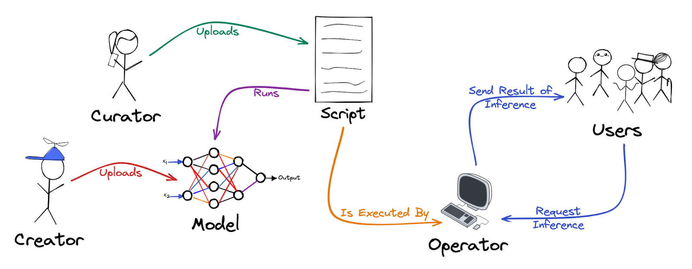
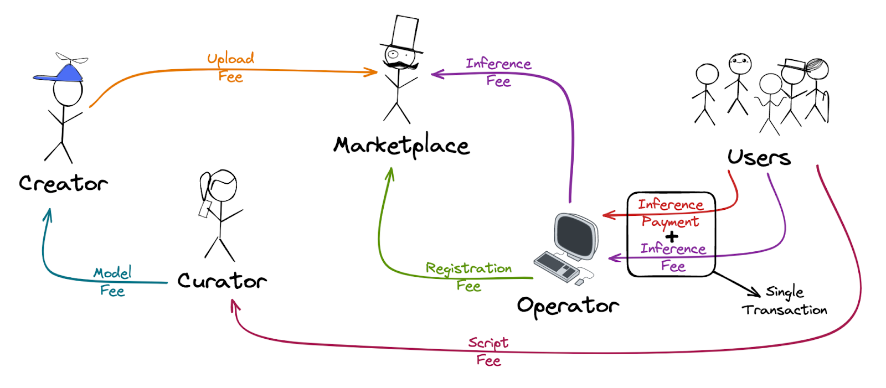

# Fair Protocol
#### **A Decentralised Inference Marketplace for Artificial Intelligence**
#### **Authors: Tiago Ferreira, Luís Silvestre**
#### **7 April 2023 (Version 0.1)**

## Abstract

Big tech companies' centralization of Artificial Intelligence (AI) computation and models has raised concerns about the concentration of power and control over AI technology. This centralization creates challenges such as limited access to AI technology for smaller organizations and potential biases in AI models that reflect the values and interests of the dominant tech companies.

This paper proposes Fair Protocol, a marketplace that pretends to address the abovementioned problems by leveraging the Arweave blockchain and its main layer 2, Bundlr, to decentralize AI inference computation. It presents a promising solution to the problem of centralization of AI computation, offering a decentralised approach that can promote more significant equity, access, and transparency in the development and deployment of AI technology. The technical details of this proposed solution are explored, as well as some risks and warnings about using it.

## I. Introduction

The rapid development of Artificial Intelligence (AI) has brought about a paradigm shift in how we interact with technology. From virtual assistants to self-driving cars, AI-powered systems are becoming increasingly pervasive in our daily lives. However, the benefits of AI are not evenly distributed, and the concentration of computing power and data in the hands of a few large companies has raised concerns about the centralization of AI capabilities.

In particular, the problem of centralization arises when companies that possess large amounts of computing resources and data also control the development and deployment of AI algorithms. This circumstance creates a power imbalance that can limit competition, innovation, and access to AI tools for smaller companies and individuals. Additionally, it can lead to privacy violations, biased algorithms, and other negative societal impacts.

One of the most significant manifestations of this problem is the AI inferences in models that are not open-source, like the newly launched GPT-4. Inference is defined as using a trained AI model to make predictions or decisions based on new data. In contrast, GPT-4 is a state-of-the-art language model developed by OpenAI and designed to be a versatile and powerful tool for natural language processing, capable of generating human-like text in response to various prompts and questions. 

Since these closed models can achieve impressive results on question answering and natural language inference at the cost of high centralised computation, and since such centralised computation results in the problems mentioned above, there is a growing demand for more decentralised and democratised AI solutions that allow for broader access and more equitable distribution of AI technology.

To respond to the above demand, we present in this paper Fair Protocol, the Marketplace that aims to decentralize an AI model inference using Arweave and Bundlr. Arweave is a blockchain-based decentralised platform that seeks to provide permanent and low-cost data storage solutions. Bundlr, on the other hand, is a layer 2 solution built on top of the Arweave blockchain that aims to provide a faster, more efficient, and cost-effective way to store and share content on the Arweave network.

The rest of the whitepaper is structured as follows. In Section II, we introduce the protocol's different participants and the relationship between them. In Section III, there is a brief explanation of the types of AI supported by the Marketplace. Sections IV and V present a detailed description of the flow and the economics of the application, respectively. A brief explanation of the types of updates supported in the Marketplace for its participants can be seen in Section VI. Sections VII and VIII discuss the balance of power between participants and the application statistics, respectively. Details on cancellations of transactions can be seen in Section IX. Penalties for application participants can be seen in Section X, while the dangers of using the application and the cautions to have when using it can be seen in Section XI. Sections XII and XIII show possible future developments and a conclusion to this paper, respectively.

## II. Participants

Marketplace participants can be divided into 5 groups: Application Users, Model Operators, Model Curators, Model Curators, and Marketplace Owners. To make it easier to understand this document, we have mentioned these groups sometimes as Users, Operators, Curators, Curators, and Marketplace, respectively. Below is an explanation of what each one of these groups represents.

### Application Users

Users are all the participants who want to obtain model inferences in a decentralised way without installing or running the same models on their devices, getting the advantages mentioned above. To do this, they will select a specific model and script to perform the AI task they want and an Operator to run it.

### Model Operators

Operators are all the participants who will run model inferences required by Users, following the rules for installing and running model scripts defined by Curators. Since running these inferences incurs computational and resource costs, each Operator charges Users a payment for its services.

Operators are responsible for performing all the inferences a User requests and validating that the code sent to the Marketplace by Curators does what it is supposed to.

### Model Curators

Curators are all the participants who put model scripts on the Marketplace. To do so, they must upload those scripts to Arweave and link them to at least one model listed in the Marketplace. The Operators will then run the software with the input from the Users to realize the inference on these models.

Curators are responsible for providing Operators with all the necessary instructions at the time of upload to run these models and scripts in the most comprehensive way possible. The provided software must check for the constant confirmation of new inference requests by Users to Operators. It must also include the validations and protections against the incorrect execution of the code and possible attacks by Users against the Operators or vice versa.

Because describing the instructions for installing models and coding the scripts is laborious and time-consuming, Curators at the time of the upload must solicit a fee that Users will pay when they first want to use the model script, as explained in Section V.

### Model Creators

Creators are the participants who put the model themselves on the Arweave. Those models should be already trained and uploaded with the corresponding weights, so Curators can create scripts that run them as easily as possible. Since eventually building such models has inherent computational costs, at the time of the upload, Creators must request a fee that will be paid by Curators when they create scripts that use the model.

Since the main goal of the Marketplace is for Creators to upload models trained by themselves, anyone can upload any file to the Marketplace only if they pay a fee required by the Marketplace. That fee aims to create a financial disincentive for potential bad actors who want to fill the application with unnecessary or dysfunctional models when uploading to Arweave.

### Marketplace Owners

Besides producing all the code of the application, the Marketplace Owners are responsible for balancing the scales between Creators, Curators, Operators, and Users, trying to keep bad actors among all of them to a minimum by creating appropriate rules for all.

As these tasks take time and the Marketplace team intends to continue developing new features and applications, the Marketplace also charges a fee for its services to Users. More details about this fee can be seen in Section V, while more information about ideas for new features and applications can be seen in Section XII.

## III. Supported AI Features

For this version of the Marketplace, we have divided the models' inference into three categories:

<ul>
    <li align="justify">Models that perform inference on text prompts;</li>
    <li align="justify">Models that perform inference on files (audios, videos, images, text files, or others);</li>
    <li align="justify">Models that perform inference on both text prompts and files.</li>
</ul>

When the Curator is performing the upload process of a model script, he must choose which of the three scenarios best suits his software. This decision is critical regarding User Experience (UX) because it will limit Users from sending text prompts or files to Operators if the software does not support any of these formats.

All supported scenarios are presented in a chat format. On the right are the files or prompts inserted by Users for Operators to perform the respective inferences, and on the left are the corresponding responses returned by Operators.

A User may have several chats separators for the same model script, and their organization is up to the User. For example, in software that makes inferences about images, a User can create a separator for each different image or can use the same chat for all of them.

Models that have dependencies on previous inferences are also supported. To accomplish this, the Curator should conform the script so that Operators can handle all the files or prompts already sent in that chat, not just the last message or prompt.

## IV. Full Flow

The whole flow of the application regarding inference can be seen in Image 1:

|| 
|:--:| 
|***Image 1:*** *Full inference flow of the Fair Protocol.*|

The process begins with a Creator submitting a model to the application and uploading it to Arweave, along with a Markdown document that presents information about, for example, what that model can do, the advantages of the model compared with others, or the usage instructions. Curators can then upload model scripts, linking them to already uploaded models. Afterwards, Operators can start running the model scripts on their computers, following the rules imposed by the Curators, and sign up to begin operating them on the Marketplace.

After that, Users can choose any model and script they wish to use and which Operator they want to use to perform inference. Text prompts or documents needed to perform inference are sent to Arweave by the Users. The Operator, in turn, will have a program running full time, waiting for any inference request written for him on Arweave, and if it has one, it will perform the inference and write the answer on Arweave. The answer will then be available for the User to read in the Marketplace.

## V. Marketplace Economy

The whole flow regarding the economics of the application can be seen in Image 2:

|| 
|:--:| 
|***Image 2:*** *Full economic flow of the Fair Protocol.*|

The Marketplace has a set of fees and payments between participants in the Marketplace. These charges aim to create the right incentives for good actors to participate in the network and do their jobs, while bad actors face penalties and are disincentivised to operate.

A more detailed description of each of the fees, as well as their corresponding explanation, can be seen below:

<ul>
    <li align="justify"><b>Upload Fee:</b> When a Creator uploads a model, they pay a fee to the Marketplace. The purpose of this fee is to discourage submissions of dysfunctional or irrelevant models to the Marketplace. The cost is fixed and amounts to 1 AR;</li>
    <li align="justify"><b>Model Fee:</b> All the model scripts must be associated with at least one model. When Curators upload the software, they need to pay all the “Model Fees” defined by the Creators whose models are associated with the model script;</li>
    <li align="justify"><b>Script Fee:</b> Before requesting the first Inference of a model script, a user must pay a fee to the correspondent Curator, who determines its amount when uploading the software. A more detailed explanation of how this fee is calculated, as well as its purpose, can be found further down in this section;</li>
    <li align="justify"><b>Registration Fee:</b> For an Operator to register on the Marketplace, it must pay a fee for each model script it starts working with. The Curators set the amount of this fee when uploading the software. A more detailed explanation of how this fee is calculated, as well as its purpose, can be found further down in this section;</li>
    <li align="justify"><b>Inference Payment:</b> Because running inferences costs operators computing power and requires time and person-hours to set up, an Operator charges the User to do it. The Operator is responsible for responding to all the requests the Users execute, on the risk of being delisted from the Marketplace if they do not do so. If the User does not pay the necessary amount for the "Inference Payment", no penalty will occur to the Operator;</li>
    <li align="justify"><b>Inference Fee:</b> A User disburses an "Inference Fee" of 5% of the amount charged by the Operator to the Marketplace. For the Users' convenience, this fee is paid in a single transaction along with the "Inference Payment" to the Operator, and the Operator then pays the same 5% to the Marketplace. If the Operator does not pay back to the Marketplace, they will automatically be delisted after 7 blocks. If the User does not reimburse the "Inference Fee", no penalty will occur to the Operator. The purpose of this fee is to pay for the work done during the creation of the Marketplace, the maintenance of the Marketplace, and to finance the team that developed the Marketplace for future projects and features. Some ideas for these developments can be found in Section XII.</li>
</ul>

Arweave takes around 7 blocks to confirm a transaction, each taking approximately 2 minutes to create. If Operators only performed inference after receiving a payment from a User, and that exact inference would be shown to the same User only after the Operator paid the "Inference Fee" to the Marketplace, a User would have to wait approximately 30 minutes between requesting and receiving a response. Even if the User paid the fee to Marketplace instead of the Operator, it would still take about 15 minutes. Since we are in an increasingly dynamic world and many of the leading models used today are based on sending and receiving text messages, conversation-style, to us waiting that long does not seem acceptable.

To solve the problem described above, we have created a solution that, to our knowledge, is unparalleled in the Arweave ecosystem. The solution consists of a one-time payment of a value in Arweave corresponding to multiple inference payments from a User to the Curator of the model scripts, known as the "Script Fee". The Curator defines this value, which will be paid when the User chooses a new model and an Operator for the first time. This way, we guarantee that some transactions are paid upfront, and users are not rewarded if they do not pay requested inferences to Operators. We can thus use Bundlr, which ensures that transactions will go to Arweave in the future and makes them almost instantly searchable. The sending of requests and receiving inference responses will only be this fast after the "Script Fee" is confirmed on the blockchain.

Users pay the Curator instead of the Marketplace to compensate them for the upload costs, the effort to manage fees, and the creation of the model script. If Curators require a price that is too high, Users may not choose it, and if they choose a price that is too low, Users may be malicious and make too many inferences without paying Operators. Due to these reasons, Operators can decide not to use the model script. In case of disproportionate prices, Users or Operators may even create duplicates of the software, as explained in Section XI. Therefore, a Curator is encouraged to set a fair price and update it accordingly.

Curators also choose the "Registration Fee," settled by Operators to the Marketplace. This fee is paid to the Marketplace rather than the Curator because someone with malicious intent could be both an Operator and a Curator simultaneously and would have no incentives to respond to inferences from Users. Since there are only Users if at least one Operator is running the script, Curators are incentivised to write optimised and resilient code for Operators and balanced scripts between Operators and Users because Users pay them. Curators chose the fee amount to give them more control when managing safeguards between Operators and Users.

Each model script can have different completion times. Since 7 blocks take approximately 15 minutes to be mined, one idea for the Curator when choosing prices for Operators and Users is estimating how many inferences each will perform within 15 minutes. This way, a malicious Operator will not be encouraged to create a fake service to receive requests and not perform any work. Also, unless the payment is made within 7 blocks, a user will be discouraged from requesting any inference to receive an immediate response.

Additionally, the Curator may place more protections in the script for Operators, protecting them from eventual malicious Users. For example, a Curator can make an Operator confirm if a User has paid all the inferences already made for that model script without considering the last 7 blocks before answering or if the same User is not making several requests to several Operators simultaneously to try to get multiple free inferences within 15 minutes. Implementing these strategies, even if it increases script execution time, should interest the Curator because it will encourage more Operators and Users to use his model script and, thus, generate more revenue for Curators.

## VI. Information Update

Due to the dynamics of the market, we allow the change of some prices submitted in the Marketplace, namely:

<ul>
    <li align="justify">"Inference Payment" can be updated by the Operators;</li>
    <li align="justify">"Script Fee" can be edited by the Curators;</li>
    <li align="justify">"Registration Fee" can be revised by the Curators;</li>
    <li align="justify">"Model Fee" can be upgraded by Creators.</li>
</ul>

We also support Creators and Curators to be able to update the information presented in the Marketplace about models and model scripts, respectively.

## VII. Checks and Balances

Arweave wallets can vote positively or negatively on some Marketplace participants or assets to assist in detecting bad actors and keeping the application's checks and balances in order. The following are the rules for those votes:

* Wallets that have paid the "Script Fee" and all the "Inference Payments" and "Inference Fees" of the requested inferences to all the Operators of a model script can vote on that model, model script, and on that Operator. The vote will be unconsidered if that wallet later decides not to pay an Operator or a Curator;
* Any wallet that has paid the "Registration Fee" and is currently providing inference responses to Users can vote on the correspondent model script;
* Wallets that have paid the "Model Fee" can vote on that model.

There is only one vote per wallet, and that wallet needs to be verified to vote using VouchDAO technology, a decentralised verification layer on top of Arweave that allows anyone to "vouch" for the identity and humanity of any other address. This way, we guarantee one vote per person and prevent malicious people from voting multiple times. The voting results will be available to all Marketplace Users whenever they choose a model, a model script, or an Operator.

Only Operators who have responded to all the inferences, except for the last 7 blocks, will be listed in the Marketplace. This rule does not guarantee that an Operator is answering the expected response. For this validation, tracking the number of favourable votes it has obtained is necessary. The same happens with Curators' model scripts to validate whether they are legit or safe.

## VIII. Statistics

The application will have several statistics about Creators, Curators, and Operators. In the case of Creators and Curators, it will be possible to see all the models and scripts that the correspondent wallets have already submitted to the Marketplace and the respective positive or negative votes. As for Operators, besides the positive or negative votes they received from Users for all model scripts, it will be possible to see the number of inferences responses returned by that wallet to all the Users for all the model scripts they operated.

## IX. Cancellations

An Operator should cancel his operation on the Marketplace whenever he goes offline. Besides not harming Users requiring inferences, the advantage of doing so is keeping their wallets' favourable statistics. So, should he ever start operating again, he will have the previous statistics to support his excellent service. When the operation is resumed, the Operator will only be required to pay the difference between the "Registration Fee" that he has already paid and the current "Registration Fee" if the latter has increased compared to the former.

## X. Punishments

If an Operator has not cancelled operation and has not responded to a User after 7 Arweave blocks, no matter the reason, they will be delisted from the Marketplace. To be listed again, an Operator must sign up for the Marketplace again and pay the “Registration Fee” again. Moreover, it needs also to send to Arweave all the requested responses that haven’t been answered. These rules ensure that Users are only penalised for 15 minutes when the Operator goes offline and incentivises Operators to always send a response to Users.

## XI. Risks, challenges, and Warnings

Users need to be careful about the files they receive from Operators. All those files may be corrupted or contain malware. Operators can also register for one model script but run different software. Users are not supposed to open any executable, only files without the expected formats as the output of the chosen model. All participants should be careful and vote negatively on participants or assets they see not behaving correctly.

Operators should also be wary of model scripts uploaded by Curators and check their code as it may contain malware or damage the device. Curators must also be prudent about files uploaded by Creators and check the uploaded models for the same reason. As a result, we advise against running or executing these devices on personal or work computers.

In case of a malicious service or a disabled Operator for less than 7 blocks ago, Users will pay for the fees as usual. No Arweave returns will be made. As a mitigation strategy for this problem, we suggest only using Operators with several positive and almost no opposing votes.

Users can also be malicious to Operators and send files to break the script created by the Curator or execute any malware on the Operators' computers. To protect against these attacks, the Curator must create several protections in the script, and the Operator must validate them.

Curators may eventually copy model scripts from each other, discouraging the creation and implementation of new model scripts in the Marketplace. Despite this risk, whoever comes to market first with a particular software should have a competitive advantage because they came first and, in principle, will have more positive and fewer negative votes. That advantage should be enough to incentivise Curators to use the Marketplace. If a Curator, despite having reached the market first, is overtaken by another who made a replica of most of his software, this is likely due to problems or inefficiencies in the script he developed. Since the second Curator solved those problems, he should be rewarded. As explained in Section XII, these rules can be revised.

Curators can use several Creators for their model script but only link one when uploading it. They can also indicate an inaccurate Creator, giving fees to the wrong person. To mitigate these problems, all participants who can vote for Curators and notice this should vote against this Curator, discouraging them from being bad actors. Also, other participants may duplicate their script and mention the correct Creators to get more positive votes and eventually high dividends from Users using their model script.

The entire Marketplace application is frontend based. As such, the Marketplace code can be checked by anyone. We recommend that all the application participants confirm what the Marketplace code does and look for potential errors to verify that Marketplace Owners are good actors and have implemented the rules correctly.

Marketplace Owners can eventually ruin Marketplace incentives if they are multiple participants simultaneously. For example, if Marketplace Owners are also wallet owners of a Curator and their respective Operators, the incentives to return messages to a User about that model script will disappear. However, Arweave is a blockchain where all transactions are publicly accessible, so anyone can cross-check data, find evidence that different wallets belong to the same person, and flag these risks publicly. Marketplace Owners are also incentivised to make the protocol work to receive more fee payments. Furthermore, if the marketplace is unreliable enough, there will be an incentive to create forks of the marketplace's code, removing the original Marketplace Owners from the rewards.

All the information displayed on the Marketplace is on Arweave. We used the "arweave.net" gateway for this application version to show all information. This decision presents a risk of a single point of failure since if this gateway goes down, all queries executed by the application will stop working. This solution also carries some challenges since the gateway only allows a certain number of queries to be executed in a certain amount of time. We pretend to change to a more decentralised gateway in the future, as presented in Section XII.

## XII. Next Steps

Our team has some ideas that may be implemented in the future, which we intend to finance using the fees paid by the Users to the Marketplace. We do not guarantee that these ideas will remain unchanged or that any of these ideas will be implemented, as everything depends on the application's success and the team's availability. Below is a list of them:

<ul>
    <li align="justify"><b>Review rules explained in this document:</b> As Fair Protocol is a novel implementation, we need to confirm how the conventions described above behave in a real scenario and review them if necessary for a future version of the application;</li>
    <li align="justify"><b>Decentralised Autonomous Organization (DAO):</b> At this moment, the application is 100% managed by the Owners. We plan to create a DAO to manage the decisions and developments of the application if the application becomes successful enough and there is a large enough community;</li>
    <li align="justify"><b>Decentralised Gateway:</b> We intend to mitigate the risk of using a centralised gateway, presented in Section XI, by using a more decentralised gateway or by targeting multiple gateways;</li>
    <li align="justify"><b>Multiple prices per Operator and model script:</b> An Operator can only choose one price per script, but inference may have different transaction costs depending on the size of the files or the number of prompts sent. It might be interesting to develop a greater diversification of prices per scenario;</li>
    <li align="justify"><b>Limit chat size:</b> Although there are models that support multiple prompts or files as inputs, they always have a limit on the number of prompts or files they can receive. As such, it might be interesting to give Curators the ability to choose the maximum word or file size that model scripts support when uploading them to Arweave;</li>
    <li align="justify"><b>Slow mode:</b> Currently, the app runs 100% with upfront payments when performing inferences. This situation increases the entrance fee for Users, and certain Users may want to test models or scripts before paying the "Script Fee". They may also only want to perform a single inference on a model. For those reasons, it may make sense for the application to have a way to make upfront payments of single requests, even if it takes 30 minutes between replies;</li>
    <li align="justify"><b>Implement ArProfile:</b> It can be interesting to associate ArProfile with Creators, Curators, Operators, or Users that want it to have a better integration of the application in Arweave's ecosystem;</li>
    <li align="justify"><b>Payments with other currencies:</b> Currently, the Marketplace only supports payments in Arweave. It may make sense to accept additional coins or tokens in the future to reach a broader market. Also, with different currencies, near-instant settlements could eventually be achievable;</li>
    <li align="justify"><b><a href="https://q4xpz2buwrju4ai3gfzkfeu3vjn2rhb2crlw7epn77vzm6wg74cq.arweave.net/hy786DS0U04BGzFyopKbqluonDoUV2-R7f_rlnrG_wU ">DataOS:</a></b> Since Fair Protocol performs model inference in a decentralised manner, it may be interesting to build on top of it a system that would obtain information from Arweave or the broader internet and render it dynamically with code components;</li>
    <li align="justify"><b>Decentralised training:</b> Our application only supports decentralised inference for the moment. To further solve the problems, presented in Section I, we may develop an application that performs model training in a decentralised manner.</li>
</ul>

## XIII. Conclusion

In conclusion, big tech companies' centralization of AI computation has raised concerns about the potential for a concentration of power and control over AI technology. Decentralising AI inference computation can help to address this problem by creating a more equitable, transparent, and accessible network for AI technology.

In this whitepaper, we demonstrate that with the help of the Arweave blockchain's permanent and decentralised storage, we can create a decentralised network for AI inference that could promote innovation in developing, deploying, and using AI technology. This approach can also assist in addressing concerns about potential biases in AI models.

While the suggested approach has challenges and risks, such as malware attacks, unpaid services, and the centralization of the gateway, those should be addressed with the proposed incentives to protocol participants and future developments. We also incorporated Bundlr technology, an Arweave layer 2, for more efficient and cost-effective content bundling.

 
